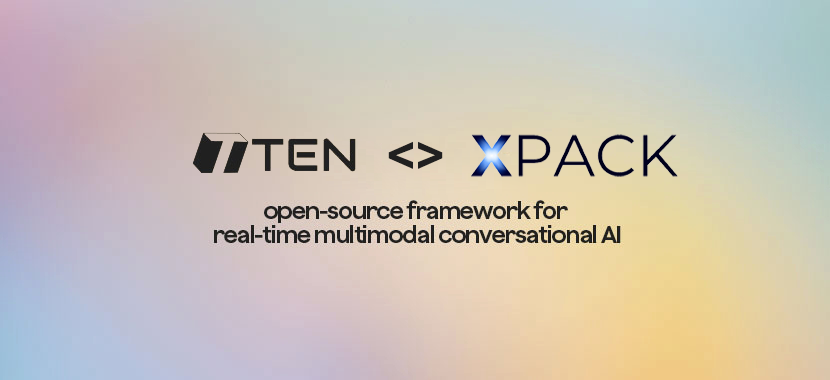
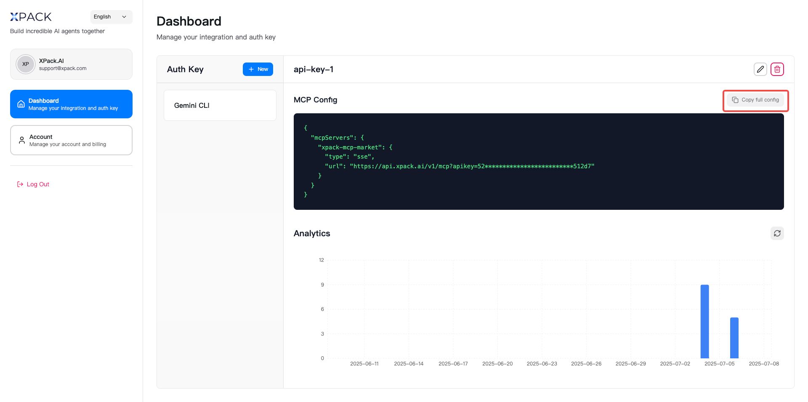
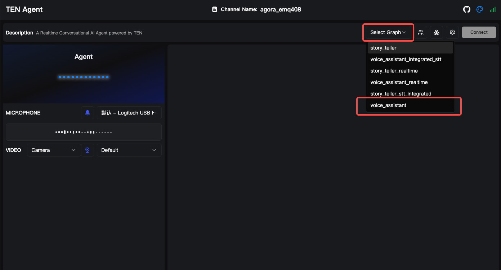
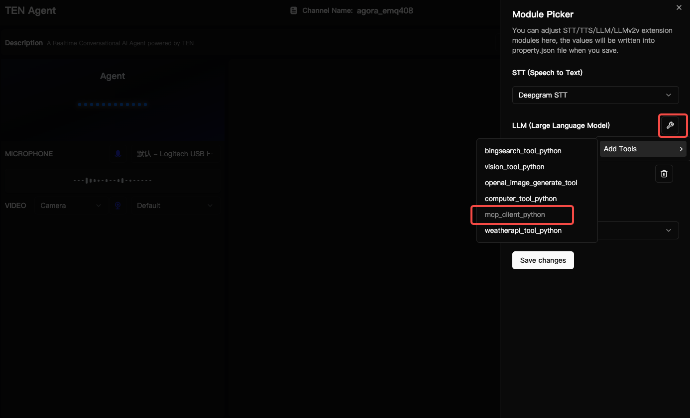
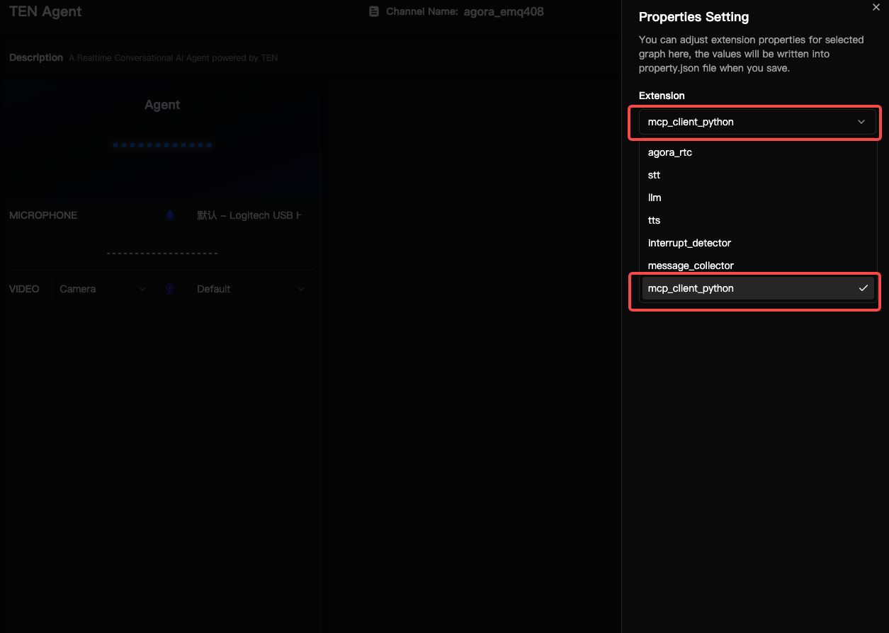
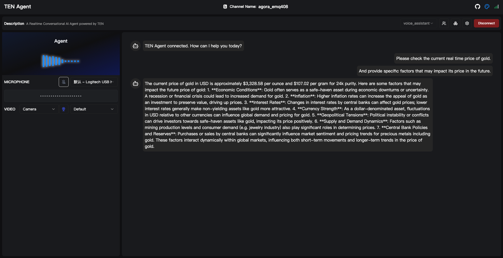
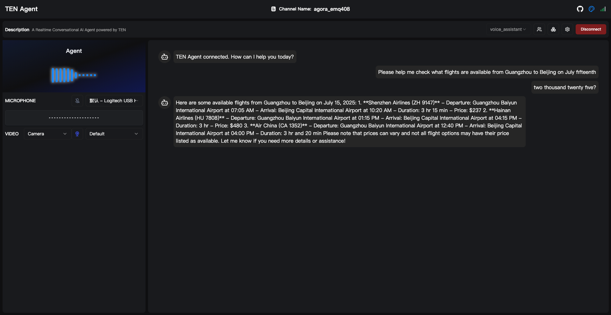

<div align="center">



[](https://github.com/TEN-framework/TEN-Agent/blob/main/LICENSE) [](https://xpack.ai)

[English](README.md) | [简体中文](docs/README-CN.md) | [日本語](docs/README-JP.md) | [한국어](docs/README-KR.md) | [Español](docs/README-ES.md) | [Français](docs/README-FR.md) | [Italiano](docs/README-IT.md)

</div>

<br>


## Introduction

TEN + XPack represents the next generation of AI agent development, combining the power of real-time multimodal AI agents with enterprise-grade tool integration capabilities. This integration enables developers to build sophisticated AI agents that can seamlessly interact with external systems, APIs, and tools through the Model Context Protocol (MCP).

## What is TEN?

**TEN** is a comprehensive open-source ecosystem for creating, customizing, and deploying real-time conversational AI agents with multimodal capabilities including voice, vision, and avatar interactions.

TEN includes [TEN Framework](https://github.com/ten-framework/ten-framework), [TEN Turn Detection](https://github.com/ten-framework/ten-turn-detection), [TEN VAD](https://github.com/ten-framework/ten-vad), [TEN Agent](https://github.com/TEN-framework/ten-framework/tree/main/ai_agents/demo), [TMAN Designer](https://github.com/TEN-framework/ten-framework/tree/main/core/src/ten_manager/designer_frontend), and [TEN Portal](https://github.com/ten-framework/portal). Check out [🌍 TEN Ecosystem](#-ten-ecosystem) for more details.


## What is XPack?

**XPack** is a comprehensive AI development platform that provides enterprise-grade tools and integrations for building sophisticated AI applications. XPack specializes in connecting AI agents with external systems through standardized protocols like MCP (Model Context Protocol).

**Key features:**
- **Tool Integration Hub**: Pre-built integrations with popular APIs and services
- **Model Context Protocol (MCP) Support**: Standardized way to connect AI models with external tools
- **Enterprise Security**: Advanced security features for production deployments
- **Scalable Infrastructure**: Cloud-native architecture for high-performance applications
- **Developer Experience**: Intuitive tools and comprehensive documentation

## Why TEN + XPack?

The combination of TEN and XPack creates a powerful ecosystem for AI agent development:

1. **Unified Development Experience**: Build multimodal AI agents with seamless tool integration
2. **Real-time Capabilities**: Process multiple data streams while maintaining tool connectivity
3. **Enterprise-Grade**: Production-ready infrastructure with security and scalability
4. **Extensible Platform**: Easy integration of custom tools and services
5. **Visual Development**: Drag-and-drop interface for rapid prototyping and development

## Quickstart

### Prerequisites

Before getting started with TEN + XPack, ensure you have the following:

| Category | Requirements |
| --- | --- |
| **Keys** | • Agora [App ID](https://docs.agora.io/en/video-calling/get-started/manage-agora-account?platform=web#create-an-agora-project) and [App Certificate](https://docs.agora.io/en/video-calling/get-started/manage-agora-account?platform=web#create-an-agora-project) (free minutes every month) <br>• [OpenAI](https://openai.com/index/openai-api/) API key (any LLM that is compatible with OpenAI)<br>• [Deepgram](https://deepgram.com/) ASR (free credits available with signup)<br>• [Elevenlabs](https://elevenlabs.io/) TTS (free credits available with signup) |
| **Installation** | • [Docker](https://www.docker.com/) / [Docker Compose](https://docs.docker.com/compose/)<br>• [Node.js(LTS) v18](https://nodejs.org/en) |
| **Minimum System Requirements** | • CPU >= 2 Core<br>• RAM >= 4 GB |

<br>

> \[!NOTE]
>
> **macOS: Docker setting on Apple Silicon**
>
> Uncheck "Use Rosetta for x86/amd64 emulation" in Docker settings, it may result in slower build times on ARM, but performance will be normal when deployed to x64 servers.

<br>


### Get TEN Agent up and running

#### Clone and Setup

```bash
# Clone the repository
git clone https://github.com/xpack-ai/ten-framework.git
cd ai_agents

# Set up environment variables
cp .env.example .env
# Edit .env with your API keys (OpenAI, Agora, etc.)
```

**Setup Agora App ID and App Certificate in .env:**

1. Get your Agora App ID and App Certificate from [Agora Console](https://console.agora.io/)
2. Add them to your `.env` file:
   ```
   AGORA_APP_ID=your_agora_app_id
   AGORA_APP_CERTIFICATE=your_agora_app_certificate
   ```

#### Start with Docker

```bash
# Start agent development containers
docker compose up -d

# Enter container
docker exec -it ten_agent_dev bash

# Build agent (~5-8 minutes)
task use

# Start the web server
task run
```

#### Access TEN Agent Playground

Open your browser and visit [localhost:3000](http://localhost:3000) to access the TEN Agent Playground.

### Configuring XPack MCP

XPack's Model Context Protocol (MCP) integration enables TEN to connect with external tools and services, dramatically expanding your agent's capabilities.

#### Obtain your XPack Auth Key:

1. Visit [XPack.AI](https://xpack.ai/) and sign up for an account
2. Generate your Auth key from your XPack dashboard



#### In TEN Playground Configuration

##### 1. Select `voice_assistant` Graph
- Enter [TEN Agent Playground](http://localhost:3000)
- In the right panel:
   - Locate **`Select Graph`** dropdown menu
   - Choose **`voice_assistant`** option



##### 2. Add MCP Extension
- Click **`Extension Icon Button`**
- In the drawer popup:
   - Find **`LLM (Large Language Model)`** section
   - Click the ** Tool Icon Button ** next to it
- In the dropdown menu:
   - Hover over **`Add Tools`** to reveal secondary menu
   - Select **`mcp_client_python`**
- Click **`Save changes`**




##### 3. Configure MCP Client
- Click **`Setting Icon Button`**
- In the configuration panel:
   - From **`Extension`** dropdown, select **`mcp_client_python`**
   - In URL field, enter:`https://api.xpack.ai/v1/mcp?apikey={YOUR_XPACK_AUTH_KEY}`
- Click **`Save changes`**



### Verification

1. **Click `Connect` button**: Start a conversation in the playground
2. **Check `task run` command line**: Confirm printed information shows successful check


## Examples of Popular Tasks

To connect your TEN to XPack, you need to configure an MCP server. This allows TEN to discover and utilize the tools available through XPack.

### Mount Tai Travel Weather Inquiry

Easily check weather conditions and sunrise/sunset times for your travel destination to help you plan your trip.

```
I want to travel to Mount Tai in China on July 15th, 2025. Please help me understand the sunrise/sunset times for that day.
```


### Real-time Gold Price Query

Quickly check current gold prices and understand key factors that may affect future price trends.

```
Please check the current real-time price of gold and provide specific factors that may impact its price in the future.
```



### Flight Information Query

Conveniently search for flight information on specific routes and times to help you plan your travel.

```
Please help me check what flights are available from Guangzhou to Beijing on July 15th, 2025.
```
