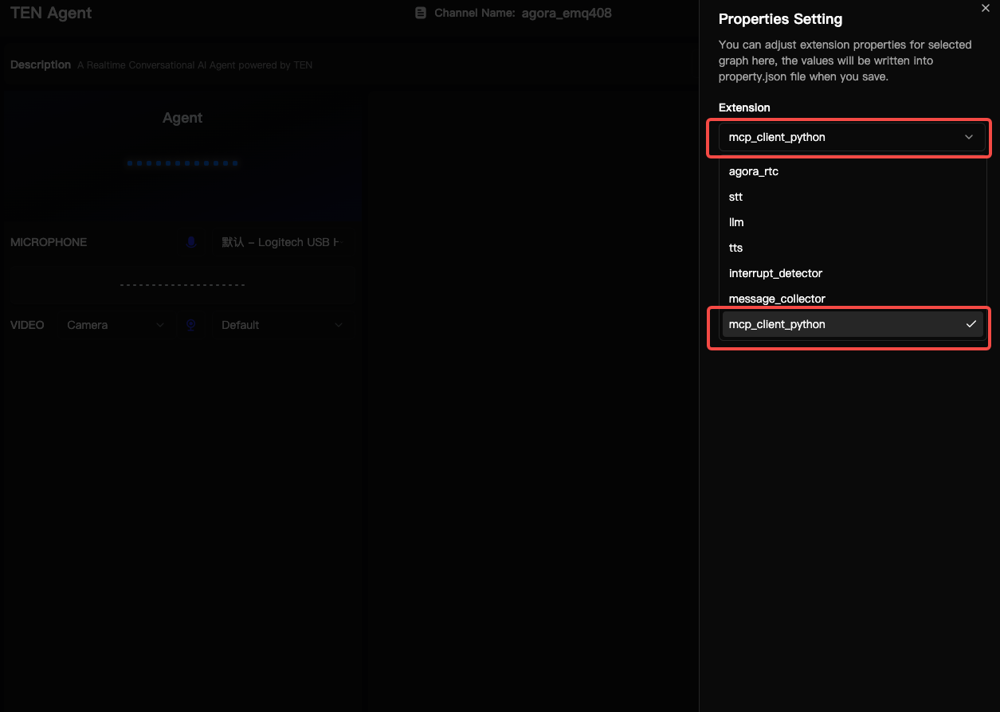
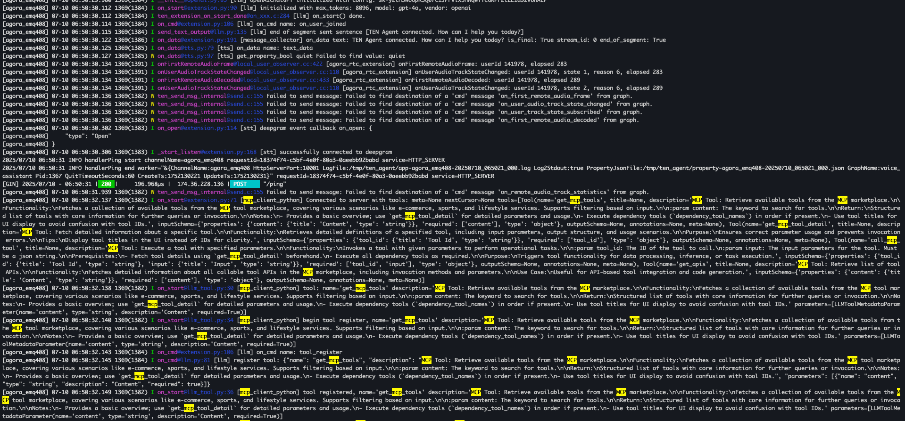

<div align="center">


[](https://github.com/TEN-framework/TEN-Agent/blob/main/LICENSE) [](https://xpack.ai)

[English](../README.md) | [简体中文](README-CN.md) | [日本語](README-JP.md) | [한국어](README-KR.md) | [Español](README-ES.md) | [Français](README-FR.md) | [Italiano](README-IT.md)

</div>

<br>


## はじめに

TEN + XPackは、リアルタイムマルチモーダルAIエージェントの強力な機能とエンタープライズグレードのツール統合機能を組み合わせた、次世代のAIエージェント開発を表しています。この統合により、開発者はModel Context Protocol（MCP）を通じて外部システム、API、ツールとシームレスに相互作用する高度なAIエージェントを構築できます。

## TENとは？

**TEN**は、音声、視覚、アバターインタラクションを含むマルチモーダル機能を持つリアルタイム会話AIエージェントを作成、カスタマイズ、デプロイするための包括的なオープンソースエコシステムです。

TENには[TEN Framework](https://github.com/ten-framework/ten-framework)、[TEN Turn Detection](https://github.com/ten-framework/ten-turn-detection)、[TEN VAD](https://github.com/ten-framework/ten-vad)、[TEN Agent](https://github.com/TEN-framework/ten-framework/tree/main/ai_agents/demo)、[TMAN Designer](https://github.com/TEN-framework/ten-framework/tree/main/core/src/ten_manager/designer_frontend)、[TEN Portal](https://github.com/ten-framework/portal)が含まれています。詳細については[🌍 TENエコシステム](#-tenエコシステム)をご覧ください。


## XPackとは？

**XPack**は、高度なAIアプリケーションを構築するためのエンタープライズグレードのツールと統合を提供する包括的なAI開発プラットフォームです。XPackは、MCP（Model Context Protocol）などの標準化されたプロトコルを通じてAIエージェントを外部システムに接続することを専門としています。

**主な機能：**
- **ツール統合ハブ**：人気のAPIやサービスとの事前構築された統合
- **Model Context Protocol（MCP）サポート**：AIモデルを外部ツールに接続する標準化された方法
- **エンタープライズセキュリティ**：本番デプロイメント用の高度なセキュリティ機能
- **スケーラブルインフラストラクチャ**：高性能アプリケーション用のクラウドネイティブアーキテクチャ
- **開発者エクスペリエンス**：直感的なツールと包括的なドキュメント

## なぜTEN + XPack？

TENとXPackの組み合わせは、AIエージェント開発のための強力なエコシステムを作り出します：

1. **統一された開発エクスペリエンス**：シームレスなツール統合を持つマルチモーダルAIエージェントを構築
2. **リアルタイム機能**：ツール接続を維持しながら複数のデータストリームを処理
3. **エンタープライズグレード**：セキュリティとスケーラビリティを備えた本番対応インフラストラクチャ
4. **拡張可能プラットフォーム**：カスタムツールとサービスの簡単な統合
5. **ビジュアル開発**：迅速なプロトタイピングと開発のためのドラッグアンドドロップインターフェース

## クイックスタート

### 前提条件

TEN + XPackを始める前に、以下を確認してください：

| カテゴリ | 要件 |
| --- | --- |
| **キー** | • Agora [App ID](https://docs.agora.io/en/video-calling/get-started/manage-agora-account?platform=web#create-an-agora-project)と[App Certificate](https://docs.agora.io/en/video-calling/get-started/manage-agora-account?platform=web#create-an-agora-project)（毎月無料分あり）<br>• [OpenAI](https://openai.com/index/openai-api/) APIキー（OpenAI互換のLLM）<br>• [Deepgram](https://deepgram.com/) ASR（サインアップで無料クレジット利用可能）<br>• [Elevenlabs](https://elevenlabs.io/) TTS（サインアップで無料クレジット利用可能）|
| **インストール** | • [Docker](https://www.docker.com/) / [Docker Compose](https://docs.docker.com/compose/)<br>• [Node.js(LTS) v18](https://nodejs.org/en) |
| **最小システム要件** | • CPU >= 2コア<br>• RAM >= 4 GB |

<br>

> \[!NOTE]
>
> **macOS：Apple SiliconでのDocker設定**
>
> Docker設定で「Use Rosetta for x86/amd64 emulation」のチェックを外してください。ARMでのビルド時間が遅くなる可能性がありますが、x64サーバーにデプロイした際のパフォーマンスは正常になります。

<br>


### TEN Agentの起動と実行

#### クローンとセットアップ

```bash
# リポジトリをクローン
git clone https://github.com/xpack-ai/ten-framework.git
cd ai_agents

# 環境変数を設定
cp .env.example .env
# APIキー（OpenAI、Agoraなど）で.envを編集
```

**.envでAgora App IDとApp Certificateを設定：**

1. [Agora Console](https://console.agora.io/)からAgora App IDとApp Certificateを取得
2. `.env`ファイルに追加：
   ```
   AGORA_APP_ID=your_agora_app_id
   AGORA_APP_CERTIFICATE=your_agora_app_certificate
   ```

#### Dockerで開始

```bash
# エージェント開発コンテナを開始
docker compose up -d

# コンテナに入る
docker exec -it ten_agent_dev bash

# エージェントをビルド（約5-8分）
task use

# Webサーバーを開始
task run
```

#### TEN Agent Playgroundにアクセス

ブラウザを開いて[localhost:3000](http://localhost:3000)にアクセスし、TEN Agent Playgroundにアクセスします。

### XPack MCPの設定

XPackのModel Context Protocol（MCP）統合により、TENは外部ツールやサービスに接続でき、エージェントの機能を大幅に拡張します。

#### XPack認証キーの取得：

1. [XPack.AI](https://xpack.ai/)にアクセスしてアカウントを登録
2. XPackダッシュボードから認証キーを生成


#### TEN Playground設定で

##### 1. `voice_assistant`グラフを選択
- [TEN Agent Playground](http://localhost:3000)に入る
- 右パネルで：
   - **`Select Graph`**ドロップダウンメニューを見つける
   - **`voice_assistant`**オプションを選択


##### 2. MCP拡張を追加
- **`Extension Icon Button`**をクリック
- ポップアップドロワーで：
   - **`LLM (Large Language Model)`**セクションを見つける
   - その隣の**ツールアイコンボタン**をクリック
- ドロップダウンメニューで：
   - **`Add Tools`**にホバーしてセカンダリメニューを表示
   - **`mcp_client_python`**を選択
- **`Save changes`**をクリック


##### 3. MCPクライアントを設定
- **`Setting Icon Button`**をクリック
- 設定パネルで：
   - **`Extension`**ドロップダウンから**`mcp_client_python`**を選択
   - URLフィールドに入力：`https://api.xpack.ai/v1/mcp?apikey={YOUR_XPACK_AUTH_KEY}`
- **`Save changes`**をクリック



### 検証

1. **`Connect`ボタンをクリック**：playgroundで会話を開始
2. **`task run`コマンドラインを確認**：印刷された情報が成功チェックを示すことを確認




## 人気タスクの例

TENをXPackに接続するには、MCPサーバーを設定する必要があります。これにより、TENはXPackを通じて利用可能なツールを発見し活用できます。

### 泰山旅行天気照会

旅行先の天気状況と日の出/日の入り時刻を簡単に確認して、旅行計画に役立てます。

```
2025年7月15日に中国の泰山に旅行したいと思います。その日の日の出/日の入り時刻を教えてください。
```


### リアルタイム金価格照会

現在の金価格を素早く確認し、将来の価格動向に影響を与える可能性のある主要要因を理解します。

```
現在の金のリアルタイム価格を確認し、将来の価格に影響を与える可能性のある具体的な要因を教えてください。
```


### フライト情報照会

特定のルートと時間のフライト情報を便利に検索して、旅行計画に役立てます。

```
2025年7月15日の広州から北京への利用可能なフライトを確認してください。
```

