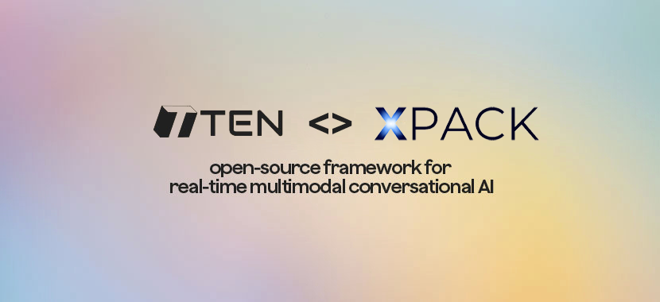
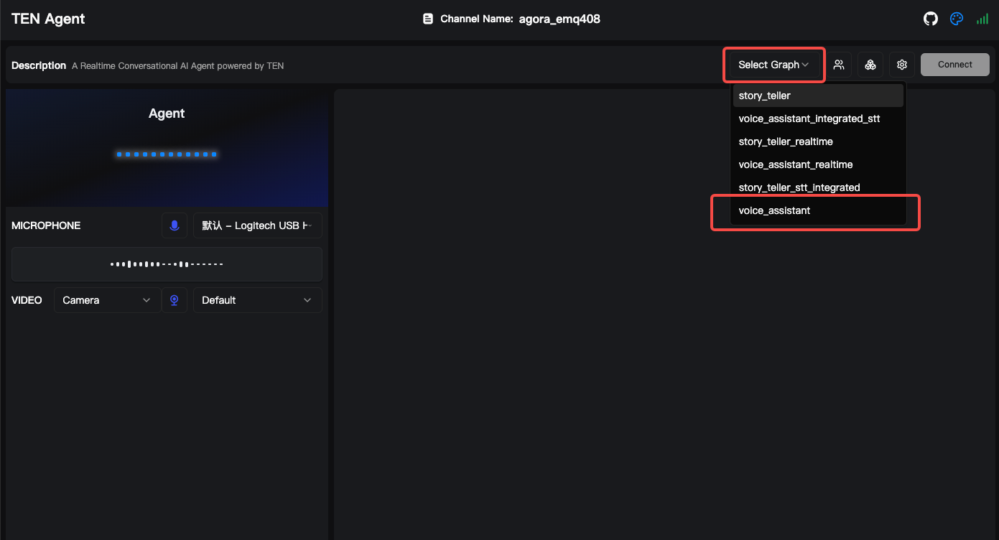

<div align="center">



[](https://github.com/TEN-framework/TEN-Agent/blob/main/LICENSE) [](https://xpack.ai)

[English](../README.md) | [简体中文](README-CN.md) | [日本語](README-JP.md) | [한국어](README-KR.md) | [Español](README-ES.md) | [Français](README-FR.md) | [Italiano](README-IT.md)

</div>

<br>


## 소개

TEN + XPack은 실시간 멀티모달 AI 에이전트의 강력한 기능과 엔터프라이즈급 도구 통합을 결합한 차세대 AI 에이전트 개발을 나타냅니다. 이 통합을 통해 개발자는 Model Context Protocol(MCP)을 통해 외부 시스템, API 및 도구와 원활하게 상호 작용하는 정교한 AI 에이전트를 구축할 수 있습니다.

## TEN이란?

**TEN**은 음성, 시각 및 아바타 상호 작용을 포함한 멀티모달 기능을 갖춘 실시간 대화형 AI 에이전트를 생성, 사용자 정의 및 배포하기 위한 포괄적인 오픈 소스 생태계입니다.

TEN에는 [TEN Framework](https://github.com/ten-framework/ten-framework), [TEN Turn Detection](https://github.com/ten-framework/ten-turn-detection), [TEN VAD](https://github.com/ten-framework/ten-vad), [TEN Agent](https://github.com/TEN-framework/ten-framework/tree/main/ai_agents/demo), [TMAN Designer](https://github.com/TEN-framework/ten-framework/tree/main/core/src/ten_manager/designer_frontend), [TEN Portal](https://github.com/ten-framework/portal)이 포함됩니다. 자세한 내용은 [🌍 TEN 생태계](#-ten-생태계)를 참조하세요.


## XPack이란?

**XPack**은 고급 AI 애플리케이션 구축을 위한 엔터프라이즈급 도구와 통합을 제공하는 포괄적인 AI 개발 플랫폼입니다. XPack은 MCP(Model Context Protocol)와 같은 표준화된 프로토콜을 통해 AI 에이전트를 외부 시스템에 연결하는 것을 전문으로 합니다.

**주요 기능:**
- **도구 통합 허브**: 인기 있는 API 및 서비스와의 사전 구축된 통합
- **Model Context Protocol(MCP) 지원**: AI 모델을 외부 도구에 연결하는 표준화된 방법
- **엔터프라이즈 보안**: 프로덕션 배포를 위한 고급 보안 기능
- **확장 가능한 인프라**: 고성능 애플리케이션을 위한 클라우드 네이티브 아키텍처
- **개발자 경험**: 직관적인 도구와 포괄적인 문서

## 왜 TEN + XPack인가?

TEN과 XPack의 조합은 AI 에이전트 개발을 위한 강력한 생태계를 만듭니다:

1. **통합된 개발 경험**: 원활한 도구 통합을 갖춘 멀티모달 AI 에이전트 구축
2. **실시간 기능**: 도구 연결을 유지하면서 여러 데이터 스트림 처리
3. **엔터프라이즈급**: 보안과 확장성을 갖춘 프로덕션 준비 인프라
4. **확장 가능한 플랫폼**: 사용자 정의 도구 및 서비스의 쉬운 통합
5. **시각적 개발**: 빠른 프로토타이핑과 개발을 위한 드래그 앤 드롭 인터페이스

## 빠른 시작

### 전제 조건

TEN + XPack을 시작하기 전에 다음을 확인하세요:

| 카테고리 | 요구 사항 |
| --- | --- |
| **키** | • Agora [App ID](https://docs.agora.io/en/video-calling/get-started/manage-agora-account?platform=web#create-an-agora-project) 및 [App Certificate](https://docs.agora.io/en/video-calling/get-started/manage-agora-account?platform=web#create-an-agora-project) (매월 무료 할당량 포함)<br>• [OpenAI](https://openai.com/index/openai-api/) API 키 (OpenAI 호환 LLM)<br>• [Deepgram](https://deepgram.com/) ASR (가입 시 무료 크레딧 제공)<br>• [Elevenlabs](https://elevenlabs.io/) TTS (가입 시 무료 크레딧 제공)|
| **설치** | • [Docker](https://www.docker.com/) / [Docker Compose](https://docs.docker.com/compose/)<br>• [Node.js(LTS) v18](https://nodejs.org/en) |
| **최소 시스템 요구 사항** | • CPU >= 2코어<br>• RAM >= 4 GB |

<br>

> \[!NOTE]
>
> **macOS: Apple Silicon에서의 Docker 설정**
>
> Docker 설정에서 "Use Rosetta for x86/amd64 emulation"을 체크 해제하세요. ARM에서 빌드 시간이 느려질 수 있지만 x64 서버에 배포할 때 성능은 정상입니다.

<br>


### TEN Agent 시작 및 실행

#### 클론 및 설정

```bash
# 저장소 클론
git clone https://github.com/xpack-ai/ten-framework.git
cd ai_agents

# 환경 변수 설정
cp .env.example .env
# API 키(OpenAI, Agora 등)로 .env 편집
```

**.env에서 Agora App ID 및 App Certificate 설정:**

1. [Agora Console](https://console.agora.io/)에서 Agora App ID 및 App Certificate 획득
2. `.env` 파일에 추가:
   ```
   AGORA_APP_ID=your_agora_app_id
   AGORA_APP_CERTIFICATE=your_agora_app_certificate
   ```

#### Docker로 시작

```bash
# 에이전트 개발 컨테이너 시작
docker compose up -d

# 컨테이너 진입
docker exec -it ten_agent_dev bash

# 에이전트 빌드 (약 5-8분)
task use

# 웹 서버 시작
task run
```

#### TEN Agent Playground 접속

브라우저를 열고 [localhost:3000](http://localhost:3000)에 접속하여 TEN Agent Playground에 액세스합니다.

### XPack MCP 설정

XPack의 Model Context Protocol(MCP) 통합을 통해 TEN은 외부 도구 및 서비스에 연결할 수 있어 에이전트의 기능을 크게 확장합니다.

#### XPack 인증 키 획득:

1. [XPack.AI](https://xpack.ai/)를 방문하여 계정 등록
2. XPack 대시보드에서 인증 키 생성


#### TEN Playground 설정에서

##### 1. `voice_assistant` 그래프 선택
- [TEN Agent Playground](http://localhost:3000)에 진입
- 오른쪽 패널에서:
   - **`Select Graph`** 드롭다운 메뉴 찾기
   - **`voice_assistant`** 옵션 선택



##### 2. MCP 확장 추가
- **`Extension Icon Button`** 클릭
- 팝업 드로어에서:
   - **`LLM (Large Language Model)`** 섹션 찾기
   - 옆의 **도구 아이콘 버튼** 클릭
- 드롭다운 메뉴에서:
   - **`Add Tools`**에 호버하여 보조 메뉴 표시
   - **`mcp_client_python`** 선택
- **`Save changes`** 클릭


##### 3. MCP 클라이언트 구성
- **`Setting Icon Button`** 클릭
- 설정 패널에서:
   - **`Extension`** 드롭다운에서 **`mcp_client_python`** 선택
   - URL 필드에 입력: `https://mcp.xpack.ai/v1/mcp?apikey={YOUR_XPACK_AUTH_KEY}`
- **`Save changes`** 클릭


### 검증

1. **`Connect` 버튼 클릭**: playground에서 대화 시작
2. **`task run` 명령줄 확인**: 인쇄된 정보가 성공 확인을 나타내는지 확인


## 인기 작업 예제

TEN을 XPack에 연결하려면 MCP 서버를 설정해야 합니다. 이를 통해 TEN은 XPack을 통해 사용 가능한 도구를 발견하고 활용할 수 있습니다.

### 태산 여행 날씨 조회

여행지의 날씨 상황과 일출/일몰 시간을 쉽게 확인하여 여행 계획에 도움을 받으세요.

```
2025년 7월 15일에 중국 태산으로 여행을 가고 싶습니다. 그날의 일출/일몰 시간을 알려주세요.
```


### 실시간 금 가격 조회

현재 금 가격을 빠르게 확인하고 미래 가격 동향에 영향을 줄 수 있는 주요 요인을 이해하세요.

```
현재 금의 실시간 가격을 확인하고 미래 가격에 영향을 줄 수 있는 구체적인 요인들을 알려주세요.
```


### 항공편 정보 조회

특정 경로와 시간의 항공편 정보를 편리하게 검색하여 여행 계획에 도움을 받으세요.

```
2025년 7월 15일 광저우에서 베이징으로 가는 이용 가능한 항공편을 확인해주세요.
```

